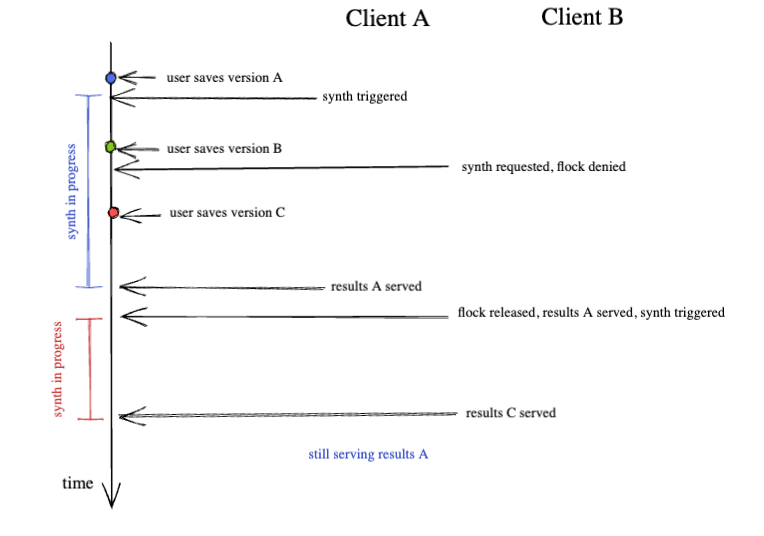
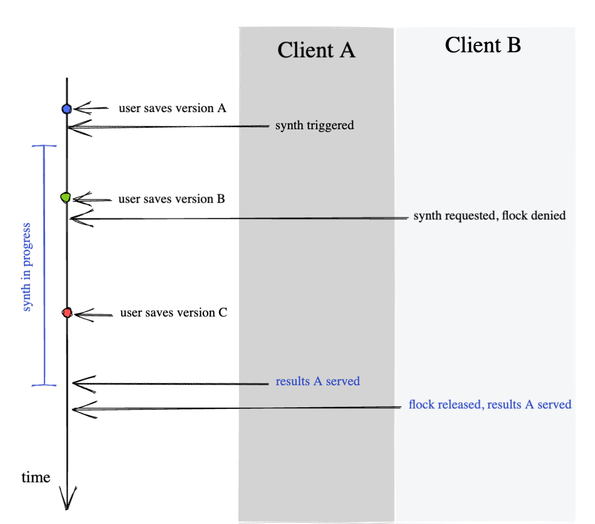
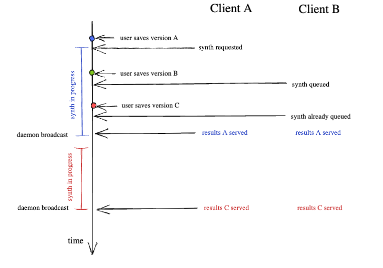
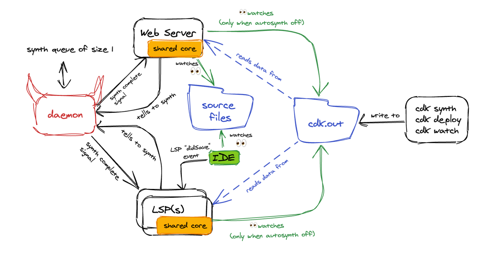

# 1. Per-Project Synth Daemon

Date: 2026-05-27

## Status

Proposed

## Context

An editor LSP and a `cdk explore` web server may observe the same CDK project simultaneously. Both need a consistent, fresh view of `cdk.out/` after file saves, and synthesis is not instantaneous.

Without coordination, three problems emerge:

1. **Torn reads.** `cdk.out/` is written non-atomically (multiple files sequentially). A consumer reading mid-write sees inconsistent state.
2. **Wasted compute.** N clients each triggering their own synth means N redundant expensive synth operations for one file save. With multiple clients and frequent saves, an unbounded fraction of wall-clock time is spent synthesizing.
3. **Stale divergence.** A synth started at T1 completes at T3, but the user saved again at T2. The output is internally consistent but doesn't reflect the latest source.

### Options considered

**Option A: Directory locking (flock on `cdk.out/`)**

Processes compete for a write lock. Winner synthesizes, losers wait and read. This solves torn reads (#1) but creates a dilemma for #2 and #3:

- *If losers synth unconditionally after acquiring the lock ("optimistic flock"):* Rapid saves produce unbounded back-to-back synths. With 3 clients and frequent saves, the system may spend near 100% of wall-clock time synthesizing. Only the last client to finish has fresh data, the others are already stale by the time they complete.

- *If losers skip synth and just read ("pessimistic flock"):* A save that occurred during the winner's synth is lost. `cdk.out/` reflects T1, not T2. All clients may show stale data with no mechanism to detect it.

**Option B: Per-project synth daemon (proposed)**

A background process that accepts requests, coalesces them via a queue-of-one latch, synthesizes, and broadcasts a signal that results are ready to all subscribers. Cost is bounded (at most one in-flight + one pending) while freshness is guaranteed.

## Decision

A per-project daemon coordinates background synthesis.

**What it solves:**

Coalesces all requests that arrive during a synth into one re-synth afterward (queue-of-one latch). At most one synth is in-flight and one is pending, regardless of how many saves or clients arrive. The daemon guarantees convergence to the latest source state without unbounded synth cost. For an LSP, freshness is critical — stale diagnostics are worse than no diagnostics.

All connected clients receive a `synthComplete`/`synthFailed` broadcast when synthesis finishes.

**What it does NOT do:**

- Does not replace `cdk synth` or `cdk deploy`. Interactive CLI commands never go through the daemon, they are too critical to depend on another process.
- Does not watch files. Clients decide when to request synth (LSP uses `didSave`, web server uses chokidar).

**Why now, not later:**

- Multi-client is a day-1 use case: the editor LSP and `cdk explore` web server both need synth coordination from the start.
- An LSP with stale data is essentially useless, freshness must be solved before building features on top.
- Unbounded synth cost from uncoordinated clients is unacceptable for a tool meant to run in the background.

**Lifecycle:**

- Started by: first client that calls `acquireDaemon(projectDir)` (connect-or-spawn)
- Discovered by: deterministic socket path from project dir (`/tmp/cdk-synth-<sha256>.sock`)
- Shut down by: idle timeout (5 min with zero subscribers), version mismatch handshake, SIGTERM
- Singleton enforced by: exclusive lock file during spawn + deterministic socket path

**CDK app stdout/stderr:**

The daemon implements `IIoHost` from `@aws-cdk/toolkit-lib`. All CDK app output during synthesis arrives as structured `IoMessage` objects via `notify()`. Nothing is silently lost.

- **Synth failures:** broadcast to all clients as `synthFailed` with the error text. Clients surface this in the editor or explorer UI.
- **App `console.log` output:** routed to the editor's Output channel via LSP `window/logMessage`. Users who need interactive stdout visibility run `cdk synth` directly, which bypasses the daemon.
- **Daemon operational messages:** written to a log file at `<socketPath>.log`.

**Terminal attachment (TTY):**

Not a concern. The CDK app is always spawned with piped stdio by `execInChildProcess` in toolkit-lib, so `process.stdout.isTTY` is `false` regardless of whether the caller is the CLI, CI, or the daemon. The daemon does not change the app's TTY status.

**Failure modes:**

| Failure | Recovery |
|---------|----------|
| Daemon crashes mid-synth | Client detects socket close, respawns via `acquireDaemon()` |
| Concurrent spawn race | Exclusive lock file (`wx` flag); loser re-checks socket after acquiring lock |
| Synth hangs | 5-minute timeout → `synthFailed` broadcast, latch returns to idle |
| CLI upgrade (version mismatch) | Handshake detects mismatch → old daemon shuts down, client spawns fresh |
| Stale socket from unclean exit | `ECONNREFUSED` → PID liveness check → cleanup and respawn |

## Consequences

**Positive:**
- Bounded synth cost with guaranteed freshness
- N clients share one synth — no wasted compute
- Pub/sub broadcast eliminates polling and `fs.watch` races

**Negative:**
- Additional process to manage (spawn, health-check, version)
- CDK app `console.log` only visible in editor Output channel during background synth
- New failure modes to handle (crash recovery, stale sockets, spawn races)

**Assumptions that would invalidate this:**
- If most users only run a single client (no web server, just one editor), flock would suffice.
- If synth becomes fast enough (<1s) that redundant synths are cheap, the coalescing benefit vanishes.
